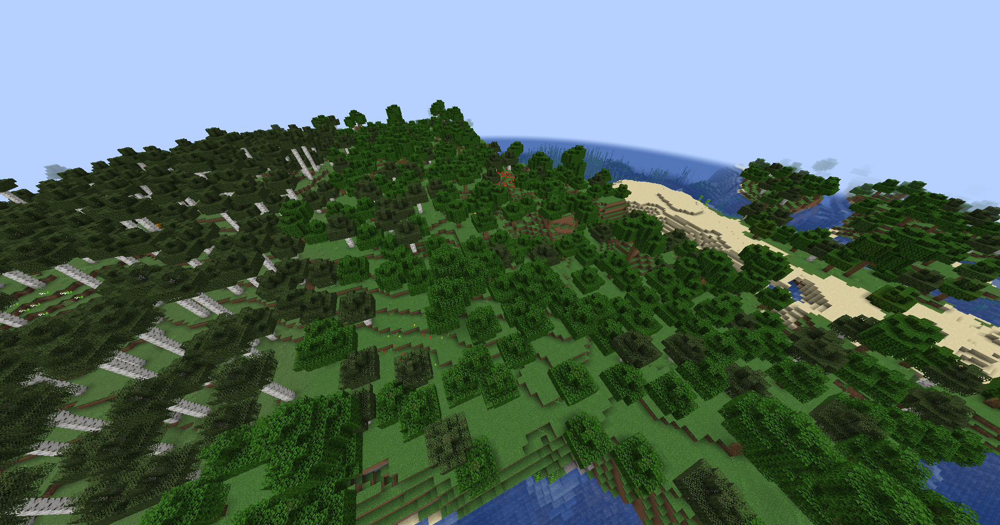
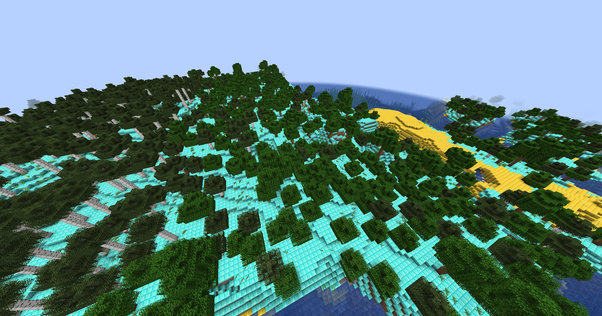

# Mass-Replacer
## Block replacing in the entire Minecraft world
<div style="width:100%;text-align:center;">
    <p align="center">
        
    </p>
</div>
<div style="width:100%;text-align:center;">
    <p align="center">
        <a href="https://www.youtube.com/@F3RNI"></a>
        <a href="https://f3rni.bandcamp.com"></a>
        <a href="https://open.spotify.com/artist/22PQ62alehywlYiksbtzsm"></a>
        <a href="https://soundcloud.com/f3rni"></a>
    </p>
</div>
<div style="width:100%;text-align:center;">
    <p align="center">
        
        
    </p>
</div>


----------

## Dependencies

- **Region-Manipulator** (.mca file reader/writer): https://github.com/PowerNukkit/Region-Manipulator, https://github.com/smartin1018/Region-Manipulator/tree/1.18.1
- **Commons-CLI** (Arguments parser): https://commons.apache.org/proper/commons-cli/
- **GSon** (JSON implementation): https://github.com/google/gson

----------

## Description

This application allows you to replace certain blocks (including blocks from mods) in the entire Minecraft world! This works even with very large worlds (takes more time).

Mass-Replacer copies the world, then opens each .mca file and replaces the specified blocks

----------

## How to use

1. Download and install JRE or JDK. Type `java -version` to check it
2. Download `.zip` from releases (or build from sources)
3. Unpack `.jar` and `.json` files from archive
4. Put your blocks to replace into `blocks.json`
   
   Example:
   ```json
   [
     {
       "from": "minecraft:grass_block",
       "to": "minecraft:diamond_block"
     },
     {
       "from": "minecraft:sand",
       "to": "minecraft:gold_block"
     }
   ]
   ```
5. Run Mass-Replacer: `java -jar Mass-Replacer-X.X-SNAPSHOT.jar -world "PATH_TO_WORLD_DIR" -out "PATH_TO_NEW_WORLD"`
    
    Example:
    ```bash
    java -jar Mass-Replacer-1.0-SNAPSHOT-all.jar -world "%AppData%\.minecraft\saves\New World" -out "%AppData%\.minecraft\saves\New World2"
    ```
6. Wait

----------

## Build from source

1. Install JDK
2. Clone repo: `git clone https://github.com/F33RNI/Mass-Replacer`
3. Run `gradle buildApp`
4. `.jar` and `blocks.json` will be in `build/libs` directory
